# 🧩 Purpose of Each File & Data Flow

This document explains the architecture and data flow of the CartPole RL project to help you **build smarter** and **debug easier**.

## 🗂️ Root Files

### 1. `train.py` — **Main Training Runner**

**Purpose**: This script is the **entry point** for training the agent. It:
* Creates the environment
* Initializes the agent
* Runs the training loop with hyperparameters
* Saves the trained model

**Involves:**
* `config.py` (gets training config like episode count, epsilon, etc.)
* `environment.py` (for creating the CartPole environment)
* `agent.py` (where training logic lives)

**Flow**:
```
train.py → config.py     # imports training settings
train.py → environment.py # gets the Gym env
train.py → agent.py      # creates and trains agent
agent.py → utils.py      # logs or plots data
```

### 2. `evaluate.py` — **Evaluate the Trained Model**

**Purpose**: Runs the **trained agent** in the environment for a few episodes to see how well it performs.

**Involves:**
* Loads the saved model
* Uses same `environment.py` and `agent.py`

**Flow**:
```
evaluate.py → config.py
evaluate.py → environment.py
evaluate.py → agent.py
```

### 3. `config.py` — **Central Hyperparameter File**

**Purpose**: Holds all the constants and hyperparameters. Examples:
* Learning rate
* Discount factor
* Epsilon decay
* Model save path

**Used by**:
* `train.py`
* `evaluate.py`

## 🧠 `src/` Folder — Core Logic

### 4. `agent.py` — **RL Agent Logic**

**Purpose**: The brain of the project. This file contains:
* The Q-learning logic (Q-table update rule)
* The exploration strategy (epsilon-greedy)
* `train()` and `evaluate()` methods
* `save()` and `load()` functions for models

**Used by**:
* `train.py` (to train)
* `evaluate.py` (to test)

### 5. `environment.py` — **Environment Creation Helper**

**Purpose**: A simple utility to initialize and return the OpenAI Gym (Gymnasium) environment. It handles both:
* `render_mode="human"` for watching during evaluation
* Basic wrappers (if needed later)

**Used by**:
* `train.py`
* `evaluate.py`

### 6. `utils.py` — **Utility Functions**

**Purpose**: A place for helper tools that don't belong in core logic, like:
* Plotting training reward
* Logging to console or file
* Saving performance graphs

## 📘 `docs/` Folder — Markdown Lessons

Each `.md` file teaches you theory or explains parts of the codebase. Great for learning & for showcasing in your portfolio.

Examples:
* `00_intro_to_rl.md` — what is RL?
* `04_training_walkthrough.md` — line-by-line `train.py` breakdown

## 📁 `models/` Folder

Stores the `.pth` file (PyTorch-style model saving) or even a `.npy` Q-table later.

## 🧪 `notebooks/`

You can test ideas or visualize rewards with plots interactively using Jupyter Notebooks here. Optional but great for learning.

## 🔁 Data Flow Diagram


## ✅ Summary Table

| File | What it Does | Used By |
|------|--------------|---------|
| `train.py` | Runs training loop | You run it to train |
| `evaluate.py` | Runs evaluation loop | You run it to test |
| `config.py` | Stores hyperparameters | All main scripts |
| `agent.py` | Q-learning logic + save/load | `train`, `evaluate` |
| `environment.py` | Returns the Gym env | `train`, `evaluate` |
| `utils.py` | Extra tools (plotting, logging) | `agent.py` (optional) |
| `models/` | Stores saved model | Created after training |
| `docs/` | Markdown lessons | For your learning |

## 📊 Q-Learning Data Flow

```mermaid
flowchart LR
    subgraph "Q-Learning Process"
        direction TB
        A[Agent observes state] --> B[Choose action using ε-greedy]
        B --> C[Take action in environment]
        C --> D[Get reward & next state]
        D --> E[Update Q-table using Bellman equation]
        E --> F[Update state]
        F --> A
    end
    
    subgraph "ε-greedy Strategy"
        direction TB
        G[Generate random number] --> H{Less than ε?}
        H -->|Yes| I[Random action]
        H -->|No| J[Best Q-value action]
    end
```



## 🔄 Training Loop Flow


